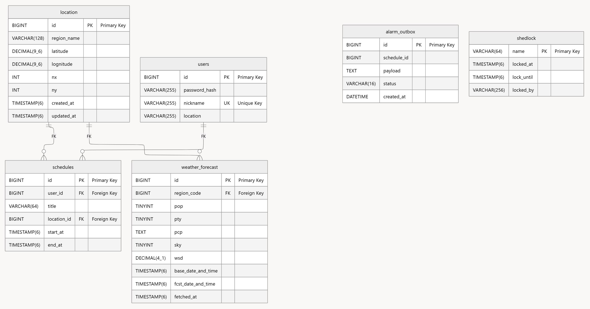

# Project : RainMind - 사용자 일정 기반 날씨 알림 서비스  
- 2026/02/16 추가 : Master 브랜치의 코드들은 구버전 코드이며, 현재 브랜치는 성능 최적화 및 정합성 보강을 위해 생성되었습니다. 현재 브랜치에서는 구버전의 테스트 코드는 동작하지 않을 수 있습니다.
  
## 목차  
- 프로젝트 개요  
- 전체 아키텍처  
- 주요 기능      
- 기술 스택  
- API 명세서 및 ER Diagram  
- 트러블 슈팅 및 주요 코드 포인트  
- k6 성능 테스트를 이용한 최적화  
- 현재 업데이트 중인 항목  
- 실행 방법  
  
## 1. 프로젝트 개요  
RainMind는 일정(Schedule) 생성 시 알림을 예약하고, 지정된 시점의 날씨 정보를 안정적으로 사용자에게 전송하는 서버 애플리케이션입니다.  
  
현재 구버전 코드에서 성능 최적화, 정합성 보강을 진행하고 있으며, docker compose 기반 EC2 실행 환경을 구축하였으며 k6 성능 테스트 및 grafana로의 시각화를 통해 꾸준히 코드를 업데이트하고 있습니다.  
  
본 프로젝트는 이후 FastAPI 기반, 동일한 알림 처리 서비스를 제공하는 프로젝트의 원본에 해당합니다. FastAPI 버전 Repository: https://github.com/LOV-ING-U/rainmind_fastapi  
  
### 🗓️ 기간  
2025.12 ~ 현재 진행형  
  
### 👩🏻‍💻 개발자
<br />  
  
| [김기환(BE)](https://github.com/LOV-ING-U) |  
| :---------------------------------------: |  
| <a href="https://github.com/LOV-ING-U"></a> |  

<br />  
  
## 2. 전체 아키텍처  
  
  
- Client 요청  
- Spring API Server 요청 수신  
- RDB (Schedule, Alarm Outbox) 삽입/삭제 및 Event 발생  
- Transactional Event Listener의 Event handle 및 Redis ZSet 조작  
- Alarm Worker의 alarm 출력, Client 응답 전송  
  
## 3. 주요 기능    
1. Client가 일정 생성/삭제 API를 호출합니다.  
2. Schedule과 Alarm Outbox를 하나의 DB 트랜잭션으로 저장합니다.  
3. 트랜잭션 commit 이후, alarm event를 Redis ZSet에 enqueue합니다.  
4. Worker가 Lua Script를 이용한 atomic dequeue를 수행하여 알람을 출력합니다.  
  
- 보조 로직 흐름  
1. 사용자는 회원가입/로그인 기능을 우선적으로 이용하여 권한을 획득합니다.  
2. 사용자는 일정을 생성할 경우, 일정 시작 시각 이전에 알람을 출력받을 수 있습니다.  
3. 또는 미리 등록한 같은 날짜의 다른 일정이 시작하는 시각의 날씨 정보를 미리 받을 수 있습니다.  
  
## 4. 사용한 기술 스택  
<p>
    
    
    
    
    
    
    
</p>  
  
## 5. API 명세서 및 ER Diagram  
**[🔗 API 명세서](https://www.notion.so/Project-RainMind-API-30973648e856802692b6f61b81ce9aef?source=copy_link)**  
- ER Diagram  
  
  
## 6. 트러블 슈팅 및 주요 코드 포인트  
1. **Outbox Pattern 적용 : DB 삽입과 Redis 삽입을 함께**  
DB 삽입과 Redis 삽입 연산을 원자적으로 수행하는 기능은 Spring 프레임워크에서는 제공하지 않는 기능입니다.  
따라서, Redis 삽입 로직을 기존 비즈니스 로직에서 분리한 후, Alarm outbox를 Schedule table과 하나의 트랜잭션으로 묶은 후, commit 이후에 event를 발행하여 Redis 연산을 처리하도록 하였습니다.  
  
또한 Redis 연산이 실패할 것을 대비하여, 일정 시간마다 PENDING Signal만을 확인하여 Redis에 enqueue 해주는 retryPending() 재시도 함수를 도입했습니다.  
  
2. **Lua Script 도입 : 분산 환경에서 Redis 연산 묶음을 안전하게**  
Redis dequeue를 위한 ZRANGEBYSCORE + ZREM 연산을 Lua Script로 묶어, 다중 worker 상황에서 중복 dequeue를 방지합니다.  
또한, Schedule이 이미 삭제된 경우에 알람을 보내서는 안됩니다. 따라서, 알람 전송 직전 DB를 참조하여 삭제된 일정인지 확인 후 알람을 전송합니다.  
  
(코드 흐름)  
```java
ScheduleService.kt 에서 일정/Outbox 트랜잭션 수행 -> Event 발생, NotifyQueueService.kt 의 Event Listener 를 통해 Redis 연산 수행 -> NotifyAlarmWorker.kt 에 의해 Alarm 출력
```  
  
3. **ShedLock 도입 : 반복 작업 스케줄러의 단일 실행 보장으로 성능 향상**  
멀티 프로세스 환경에서, 모든 프로세스가 반복 작업 스케줄러를 수행하는 것보다 하나의 프로세스만 반복 작업을 수행하는 것이 서버의 성능 향상에 도움이 됩니다. 따라서, ShedLock을 도입하여 오직 하나의 프로세스만 반복 작업을 수행하게 하여 성능을 향상시킵니다.  
  
4. **Exception 정책 : 구조화된 에러 유형 정의**  
Service Layer의 모든 함수마다 try-catch 문을 사용하여 에러를 출력한다면, 서비스 레이어 함수 하나를 추가할 때마다 코드 길이가 계속 길어지며 같은 패턴이 반복됩니다.  
  
따라서, 루트에 커스텀 RuntimeException인 GlobalException 하나를 만든 후, 본 프로젝트에서 발생하는 모든 서비스 레이어 로직의 exception은 해당 exception을 상속하여 만들도록 하였습니다. 또한 각 exception마다 http Status 및 http Error Code Pattern을 별도로 두어, 에러 발생시 추적이 쉽도록 하였습니다.  
  
(코드 흐름)  
```java
class GlobalException -> class ScheduleException, class UserException, ...(inherited)
exception 발생 시 class GlobalExceptionHandler 로 이동하여 HTTP 응답 메시지 생성  
```  
  
+ 그외 기술적 의사결정들(세션 기반/JWT 기반 선택, RestClient 별도 분리, 해당 기술 스택들 선택 이유 등)에 대해서는 아래 기술 블로그를 참조해 주세요.  
기술 블로그: https://lov-ing-u.github.io/categories/rainmind  
  
## 7. k6 성능 테스트를 이용한 최적화(1차)  
1. **회원가입 기능 응답시간 최적화**  
- BCrypt 연산으로 인한 CPU 병목 파악, p(95) 최대 10배 개선  
- 대안으로 BCrypt gensalt() 인자값 설정, Argon2와 같은 대체 암호화 알고리즘 제안  
  
| 개선 전/후 | avg | p(90) | p(95) | max | RPS(req / s) |   
| --------- | --- | ----- | ----- | --- | ------------ |  
| 개선 전 | 3.68s | 3.91s | 3.96s | 6.14s | 27.044926 |  
| 개선 후 | 153.89ms | 344.7ms | 415.77ms | 1.44s | 648.711365 |  

2. **로그인 기능 응답시간 및 DB Connection Pool 최적화**  
- 무작위 로그인 공격으로 인한 내부 CPU 자원 및 DB 커넥션 풀 고갈 고려, Redis(외부 저장소) 기반 IP 캐싱 활용, 평균/p(90)/p(95) 응답시간 / RPS / DB 커넥션 풀 3배 이상 개선  
  
| 개선 전/후 | avg | p(90) | p(95) | max | RPS(req / s) | active DB connection(개 / min) |   
| --------- | --- | ----- | ----- | --- | ------------ | ------------------------------ |  
| 개선 전 | 223.88ms | 455.8ms | 602.69ms | 1.42s | 851.823838 | 약 3.83 |   
| 개선 후 | 64.09ms | 123.08ms | 180.17ms | 3.01s | 2669.172776 | 1.08 |  
  
3. **Schedule 생성 기능 응답시간 및 Heap memory, DB Connection Pool 최적화**  
- Native Query를 이용한 기본 제공 JDBC Repository 함수 사용시 대비, 기존 비즈니스 로직의 힙 메모리 사용량 2.5배 개선 및 불필요 DB 커넥션 풀 할당 평균 1개 이하로 개선  
  
| 개선 전/후 | avg | p(90) | p(95) | max | RPS(req / s) | JVM Heap Memory(MB) | JVM Heap Memory(%) | JVM Stop the world | DB 커넥션 풀 | App Total Memory(MB) | CPU Total |   
| --------- | --- | ----- | ----- | --- | ------------ | ------------------- | ------------------ | -------------- | ----------- | -------------------- | --------- |   
| 개선 전 | 1.6s | 2.75s | 3.33s | 12.87s | 123.596799 | 359.12 | 17.61 | 36.25 | 44.48 | 1002.95 | 1.28 |    
| 개선 후 | 17.2ms | 9.25ms | 72.25ms | 1.82s | 398.995026 | 147.97 | 7.41 | 3.68 | 0.62 | 596 | 0.55 |  
  
## 8. 현재 업데이트 중인 항목  
- **retryPending() 로직 강화 : findAllBy에서 Pageable로**  
짧은 시간마다 DB 전체를 읽는 쿼리는 서버에 심한 부하를 줄 수 있으므로, Pageable 또는 Native Query를 이용하여 정해진 개수만큼 PENDING Signal을 가져오는 것이 응답시간을 줄일 수 있을 것입니다.  
  
- **Message 발행을 안전하게 : Redis Stream vs RabbitMQ**  
현재의 Redis ZSet 구조는 서버의 알람 발행 이후, 사용자의 도착을 보장할 방법이 없습니다. 따라서, 자체 ACK 기능을 보유한 RabbitMQ 혹은 ....  
  
- **Redis 사용 메모리 절약 : 복수의 Key 사용**  
Redis ZSet은 데이터 개수가 적을때에는 내부적으로 zip list만을 사용합니다. 반면 데이터 개수가 일정량 이상을 넘어가면 확률적 삽입을 수행하는 skip list 및 hash table로 저장 자료구조가 바뀝니다. 따라서, 유저마다 key를 따로 두는 등의 방식을 통해 같은 양의 데이터를 저장하여도 사용하는 메모리를 훨씬 절약할 수 있을 것입니다.  
  
## 9. 실행 방법  
프로젝트의 핵심 기능을 테스트할 수 있는 테스트 코드가 존재합니다. 테스트 항목은 로그인/로그아웃/회원가입, Redis 알람 등록/삭제 확인 과정입니다. 아래 과정을 통해 테스트할 수 있습니다.  
  
1) docker 실행
2) docker 띄우기 : **docker compose up -d**  
3) 테스트 코드 실행 : **./gradlew test**  
  
실제 기상청 API를 호출하는 로직 또한 테스트 코드 내부에 존재하나, 해당 테스트는 기상청 API 인증키를 필요로 하는 관계로 주석으로만 명시하였습니다.