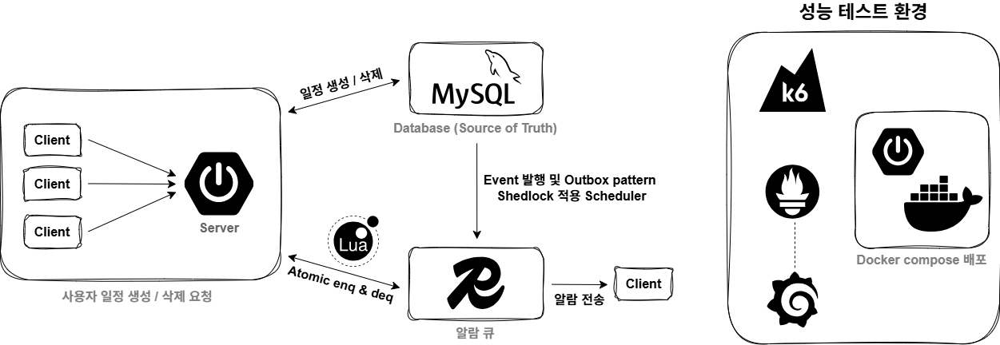

# Project : RainMind - 사용자 일정 기반 날씨 알림 서비스  
  
## 목차  
- 프로젝트 개요  
- 전체 아키텍처  
- 시스템 흐름  
- 기술 스택    
- 문제 정의  
- 기술적 의사결정  
- 트러블 슈팅 및 주요 코드 포인트  
- 실행 방법  
  
## 1. 프로젝트 개요  
RainMind는 일정(Schedule) 생성 시 알림을 예약하고, 지정된 시점의 날씨 알림 이벤트를 안정적으로 처리하기 위한 서버 애플리케이션입니다.  
  
알림 이벤트를 Redis에 저장함으로써 서비스 성능을 끌어올리고, 데이터 정합성 문제 해결을 위해 Outbox pattern을 적용하였습니다.  
  
본 프로젝트는 이후 FastAPI 기반, 동일한 알림 처리 서비스를 제공하는 프로젝트의 원본에 해당합니다. FastAPI 버전 Repository: https://github.com/LOV-ING-U/rainmind_fastapi  
  
## 2. 전체 아키텍처  
  
  
- Client 요청  
- Spring API Server 요청 수신  
- RDB (Schedule, Alarm Outbox) 삽입/삭제 및 Event 발생  
- Transactional Event Listener의 Event handle 및 Redis ZSet 조작  
- Alarm Worker의 alarm 출력, Client 응답 전송  
  
## 3. 시스템 흐름  
- 주요 로직 흐름  
1. Client가 일정 생성/삭제 API를 호출합니다.  
2. Schedule과 Alarm Outbox를 하나의 DB 트랜잭션으로 저장합니다.  
3. 트랜잭션 commit 이후, alarm event를 Redis ZSet에 enqueue합니다.  
4. Worker가 Lua Script를 이용한 atomic dequeue를 수행하여 알람을 출력합니다.  
  
- 보조 로직 흐름  
1. 사용자는 회원가입/로그인 기능을 우선적으로 이용하여 권한을 획득합니다.  
2. 사용자는 일정을 생성할 경우, 일정 시작 시각 이전에 알람을 출력받을 수 있습니다.  
3. 또는 미리 등록한 같은 날짜의 다른 일정이 시작하는 시각의 날씨 정보를 미리 받을 수 있습니다.  
  
## 4. 기술 스택  
<p>
    
    
    
    
    
</p>  
  
## 5. 기술적 의사결정  
1. Outbox Pattern 적용  
Redis를 알람 큐 용도로 사용하기 위해서는 DB에 Schedule이 저장될 때마다 그에 맞는 Event를 Redis에 저장할 필요가 있었습니다. 그러나 DB와 Redis 사이의 완전한 데이터 정합성 설계는 현실적으로 불가능합니다. 따라서, Schedule과 Alarm Outbox를 하나의 트랜잭션으로 묶어 DB 정합성을 보장합니다.  
Redis enqueue/dequeue는 트랜잭션 commit 이후에 수행됩니다.  
  
2. Lua Script 도입 atomic dequeue  
Redis dequeue를 위한 ZRANGEBYSCORE + ZREM 연산을 Lua Script로 묶어, 다중 worker 상황에서 중복 dequeue를 방지합니다.  
  
3. 삭제시 알람 정리  
일정 삭제 시 Outbox 상태를 DELETED로 변경하고, 트랜잭션 commit 이후 Redis에서도 해당 알림을 제거합니다. Redis dequeue시 Redis ZSet의 score만을 이용하므로, 삭제된 일정에 대한 알림 출력을 방지하기 위해 Redis에서도 해당 알림을 제거합니다.  
  
4. 그외 기술적 의사결정들(세션 기반/JWT 기반 선택, RestClient 별도 분리, 해당 기술 스택들 선택 이유 등)에 대해서는 아래 기술 블로그를 참조해 주세요.  
기술 블로그: https://lov-ing-u.github.io/categories/rainmind  
  
## 6. 트러블 슈팅 및 주요 코드 포인트  
1. DB와 Redis 정합성의 범위  
DB와 Redis 사이의 완전한 정합성은 현실적으로 달성하기 매우 어렵습니다. 두 연산을 하나의 트랜잭션으로 완벽히 묶을 수 없고, 너무나 다양한 장애 사유(enq/dequeue 과정 중 장애 발생 등)가 존재하기 때문입니다.  
  
따라서 본 프로젝트에서는, DB와 Redis 둘 중 하나의 장애 발생에 따른 데이터 정합성의 불일치를 이슈로 보고 이를 해결하기 위해 Outbox pattern + retry + DB check 방식을 도입했습니다.  
  
일정(Schedule)을 등록하면, Outbox table에도 해당 일정을 등록하며 이 두 과정은 트랜잭션에 의해 보호받습니다. 트랜잭션 commit이 성공한 경우에만 Event가 발행되어 Redis ZSet에 enq/dequeue되고, 일정 시간마다 도는 worker에 의해 알람이 출력됩니다.  
  
그러나 enqueue의 경우, 트랜잭션은 성공했지만 redis에 enqueue되지 않을 수 있고, redis에 enqueue는 되었지만 Outbox status가 PENDING에서 머물러 있을 수 있습니다. 따라서, 일정 시간마다 이러한 PENDING Outbox를 다시 확인하여 Redis에 enqueue 해주는 retryPending() 함수를 도입했습니다.  
  
Dequeue의 경우도 마찬가지입니다. Worker가 dequeue를 호출하는데, 이미 삭제된 일정의 경우 알람을 보내서는 안됩니다. 일정 삭제 이후 Redis에 반영이 되지 않았을 때를 대비하여 Worker에서 DB를 먼저 check한 후 삭제가 확인되면 알람을 출력하도록 설계했습니다.  
  
(코드 흐름)  
```java
ScheduleService.kt 에서 일정/Outbox 트랜잭션 수행 -> Event 발생, NotifyQueueService.kt 의 Event Listener 를 통해 Redis 연산 수행 -> NotifyAlarmWorker.kt 에 의해 Alarm 출력
```  
  
2. Exception 정책  
서비스 레이어의 모든 함수마다 try-catch 문을 사용하여 에러 메시지를 출력한다면, 서비스 레이어 함수 하나를 추가할 때마다 코드 길이가 계속 길어지며 같은 패턴이 반복됩니다.  
  
따라서, 루트에 커스텀 RuntimeException인 GlobalException 하나를 만든 후, 본 프로젝트에서 발생하는 모든 서비스 레이어 로직의 exception은 해당 exception을 상속하여 만들도록 하였습니다. 또한 각 exception마다 http Status 및 http Error Code Pattern을 별도로 두어, 에러 발생시 추적이 쉽도록 하였습니다.  
  
그리고 별도의 GlobalExceptionHandler를 두어 본 프로젝트의 모든 exception을 처리할 수 있도록 하였습니다.  
  
(코드 흐름)  
```java
class GlobalException -> class ScheduleException, class UserException, ...(inherited)
exception 발생 시 class GlobalExceptionHandler 로 이동하여 HTTP 응답 메시지 생성  
```  
  
## 7. 한계 및 trade off  
Alarm dequeue 이후 장애에 의해 알람이 유실될 경우가 존재합니다. Redis dequeue 이후 worker 장애 시 유실 가능성을 허용(At most once)한 설계이며, 알림 시스템 특성상 이를 위한 복잡한 상태 관리보다는 코드의 단순함과 운영 안정성을 우선하도록 했습니다.  
  
## 8. 실행 방법  
프로젝트의 핵심 기능을 테스트할 수 있는 테스트 코드가 존재합니다. 테스트 항목은 로그인/로그아웃/회원가입, Redis 알람 등록/삭제 확인 과정입니다. 아래 과정을 통해 테스트할 수 있습니다.  
  
1) docker 실행
2) docker 띄우기  
docker compose up -d  
3) 테스트 코드 실행  
./gradlew test  
  
실제 기상청 API를 호출하는 로직 또한 테스트 코드 내부에 존재하나, 해당 테스트는 기상청 API 인증키를 필요로 하는 관계로 주석으로만 명시하였습니다.